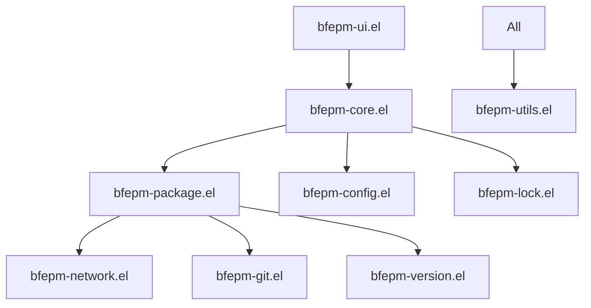

# bfepm: Better Fast Emacs Package Manager

A modern, declarative package manager for Emacs that emphasizes simplicity, speed, and reliability.

## ⚠️ Development Status

**Current Version**: v0.1.0-beta (Near Production Ready)

bfepm is in active development with core functionality implemented, tested, and stable. The package manager is approaching production readiness.

### 🎯 Current Status
- ✅ **Solid Core Foundation** with modular architecture (11 modules)
- ✅ **Configuration System** (TOML + minimal fallback) with validation
- ✅ **Package Management** with async operations and dependency resolution  
- ✅ **Interactive UI** with tabulated interface and advanced features
- ✅ **Network Layer** with retry logic, rate limiting, and error recovery
- ✅ **Lock File System** with S-expression format and metadata tracking
- ✅ **Git Package Support** with branch/tag/commit handling
- ✅ **Version Management** with semantic and MELPA date version support
- ✅ **Comprehensive Testing** (63 tests with high coverage)
- ✅ **CI/CD Pipeline** with multiple Emacs versions and quality checks
- ✅ **Code Organization** with proper separation of concerns
- 🚧 **Currently Working On**: Profile management and multi-source support
- 📋 **Next Priority**: Advanced caching and incremental updates

See [Implementation Status](#-implementation-status) for detailed progress.

## 🌟 Key Features

### ✨ **Currently Available**
- **🔧 Declarative Configuration**: Single TOML file for all package management
- **🔒 Lock Files**: Reproducible installations with S-expression metadata
- **🌐 Multi-Source Support**: MELPA, GNU ELPA, Git repositories
- **⚡ Async Operations**: Non-blocking downloads and installations
- **🎛️ Interactive UI**: Advanced package management interface
- **📦 Dependency Resolution**: Automatic dependency installation
- **🔄 Error Recovery**: Robust retry logic and rollback capabilities
- **🏷️ Version Constraints**: Semantic versioning and flexible constraints

### 🚀 **Coming Soon**
- **👤 Profile System**: Different configurations for different use cases
- **💾 Advanced Caching**: Intelligent metadata and download caching
- **🔄 Incremental Updates**: Smart package updates and backups
- **📊 Usage Analytics**: Package usage tracking and recommendations

## 🚀 Quick Start

### Installation (Development)

```bash
# Clone the repository
git clone https://github.com/SuzumiyaAoba/bfepm.git
cd bfepm

# Install dependencies using Keg
make install

# Run tests to verify setup
make test

# Try the interactive demo
./demo.sh
```

### Basic Usage

Create a `bfepm.toml` file in your Emacs directory:

```toml
[packages]
company = "latest"
magit = "^3.3.0"
lsp-mode = { version = "^8.0", optional = true }

# Git packages with specific references
doom-modeline = { git = "https://github.com/seagle0128/doom-modeline.git", tag = "v3.4.0" }
straight-el = { git = "https://github.com/radian-software/straight.el.git", branch = "master" }

[packages.company.config]
company-idle-delay = 0.3
company-minimum-prefix-length = 2

[sources]
melpa = { url = "https://melpa.org/packages/", priority = 10 }
gnu = { url = "https://elpa.gnu.org/packages/", priority = 5 }
```

Load bfepm in your Emacs configuration:

```elisp
;; Add bfepm to load path
(add-to-list 'load-path "/path/to/bfepm/lisp")

;; Initialize bfepm
(require 'bfepm)
(bfepm-init)

;; Interactive commands
;; M-x bfepm-install       # Install a package
;; M-x bfepm-update        # Update packages
;; M-x bfepm-list          # List installed packages
;; M-x bfepm-ui            # Open package management UI
```

## 🎮 Interactive Demo

Experience BFEPM's capabilities with the included demo:

```bash
# Run the interactive demo
./demo.sh
```

**Demo Features:**
- **📱 Package Management UI** (`C-c e g`) - Modern tabulated interface
- **📦 Package Installation** (`C-c e t`) - Install from sample configuration  
- **🎭 Mock Installation** (`C-c e M`) - Safe simulation mode
- **⚙️ Configuration Viewing** (`C-c e c`) - Inspect current setup
- **❓ Help System** (`C-c e h`) - Complete command reference

The demo runs in an isolated environment and auto-cleans on exit.

## 🏗️ Architecture

bfepm follows a **modular, domain-driven architecture**:

### 📦 **Core Modules**
```
User Interface Layer
├── bfepm.el                 # Main entry point and interactive commands
├── bfepm-ui.el             # Interactive package management interface
└── Interactive Commands    # bfepm-install, bfepm-update, etc.

Core Business Logic
├── bfepm-core.el           # Core functionality and data structures  
├── bfepm-package.el        # Package installation and management
├── bfepm-config.el         # TOML configuration parsing and validation
├── bfepm-config-minimal.el # Fallback configuration system
└── bfepm-lock.el           # Lock file generation and verification

Domain Services  
├── bfepm-network.el        # HTTP operations, downloads, and retry logic
├── bfepm-git.el           # Git operations and repository management
├── bfepm-version.el       # Version comparison and constraint handling
└── bfepm-utils.el         # Generic utilities and error handling
```

### 🔄 **System Interactions**


## 📋 Configuration Reference

### 📦 **Package Specifications**

```toml
[packages]
# Latest version
company = "latest"

# Specific version  
magit = "3.3.0"

# Version constraints (semantic versioning)
lsp-mode = "^8.0"      # Compatible with 8.x
flycheck = "~32.0"     # Patch-level compatibility

# MELPA date versions
vertico = "^20240601"  # From June 1, 2024 onwards
marginalia = "~20240520.1200"  # Specific timestamp

# Git packages
doom-modeline = { git = "https://github.com/seagle0128/doom-modeline.git", tag = "v3.4.0" }
straight-el = { git = "https://github.com/radian-software/straight.el.git", branch = "develop" }
my-package = { git = "https://github.com/user/package.git", ref = "abc123def" }

# Advanced options
use-package = { version = "2.4.4", bootstrap = true, optional = false }
```

### ⚙️ **Package Configuration**

```toml
[packages.company.config]
company-idle-delay = 0.3
company-backends = ["company-capf", "company-dabbrev"]

[packages.company.keybinds] 
"C-n" = "company-select-next"
"C-p" = "company-select-previous"
"TAB" = "company-complete"

[packages.company.hooks]
after-init = "global-company-mode"
prog-mode = "company-mode"
```

### 🌐 **Source Configuration**

```toml
[sources]
melpa = { url = "https://melpa.org/packages/", type = "elpa", priority = 10 }
gnu = { url = "https://elpa.gnu.org/packages/", type = "elpa", priority = 5 }
nongnu = { url = "https://elpa.nongnu.org/packages/", type = "elpa", priority = 7 }
local = { path = "/path/to/local/packages", type = "local", priority = 20 }
```

## 🧪 Development

### 🔨 **Build System**

```bash
# Development workflow
make help          # Show all available targets
make install       # Install dependencies (Keg required)
make install-ci    # Install for CI (no Keg)

# Quality assurance
make compile       # Compile Elisp files with strict warnings
make lint          # Run package-lint and checkdoc
make test          # Run full test suite (63 tests)
make test-coverage # Run tests with coverage reporting
make check         # Full quality check (compile + lint + test)
make check-ci      # CI version with fallback dependencies

# Maintenance
make clean         # Remove compiled files
make build         # Full build process
make build-ci      # CI build process
```

### 📊 **Testing**

Comprehensive test suite with **63 tests** covering:

```bash
# Test suites by module
test/bfepm-test.el           # Core functionality tests
test/bfepm-config-test.el    # Configuration parsing tests  
test/bfepm-utils-test.el     # Utility function tests
test/bfepm-ui-test-simple.el # UI component tests
test/bfepm-async-test.el     # Async operation tests
test/bfepm-version-test.el   # Version handling tests
test/bfepm-network-test.el   # Network operation tests

# Run specific test suite
emacs -batch -L lisp -L test -l test/bfepm-test.el -f ert-run-tests-batch-and-exit
```

### 🔧 **Requirements**

- **Emacs**: 29.1+ (for built-in functions and performance)
- **Dependencies**:
  - `toml` package (optional, for TOML support)
  - Development: Keg package manager
- **System Tools**: `git`, `tar` (for package operations)

## 📈 Implementation Status

### ✅ **Completed Features**
- **Core Architecture**: Modular design with 11 specialized modules
- **Configuration System**: TOML parsing with fallback and validation  
- **Package Management**: Install, update, remove with dependency resolution
- **Network Operations**: Async downloads with retry logic and rate limiting
- **Git Integration**: Clone, checkout, tag/branch/commit support
- **Version Handling**: Semantic and MELPA date version constraints
- **Lock Files**: S-expression format with comprehensive metadata
- **Interactive UI**: Tabulated interface with filtering and batch operations
- **Error Handling**: Comprehensive error recovery and user feedback
- **Testing Infrastructure**: 63 tests with high coverage across all modules
- **CI/CD Pipeline**: Multi-version testing and quality checks
- **Code Quality**: Lint-free codebase with proper documentation

### 🚧 **In Development**  
- **Profile Management**: Multiple configuration profiles for different use cases
- **Advanced Multi-Source**: Enhanced source management and fallback strategies
- **Dependency Optimization**: Improved conflict resolution and circular dependency detection

### 📋 **Planned Features**
- **Intelligent Caching**: Package metadata and download caching with invalidation
- **Incremental Updates**: Smart package updates with rollback capabilities  
- **Usage Analytics**: Package usage tracking and recommendations
- **Configuration Sync**: Remote configuration synchronization
- **Plugin System**: Extensible plugin architecture
- **Performance Optimization**: Further async improvements and caching

## 🤝 Contributing

bfepm welcomes contributors! Here's how to get involved:

### 🛠️ **Development Workflow**

1. **Review Priorities**: Check current [milestones](https://github.com/SuzumiyaAoba/bfepm/milestones)
2. **Fork & Branch**: Create a feature branch from `master`
3. **Follow Guidelines**: Use `bfepm-` prefix, add docstrings, write tests
4. **Quality Check**: Run `make check` before submitting
5. **Submit PR**: Include clear description and test plan

### 📋 **Development Guidelines**

- **Code Style**: Follow Emacs Lisp conventions with `lexical-binding: t`
- **Documentation**: Add docstrings to all public functions (checkdoc compliant)
- **Testing**: Write ERT tests for new functionality (maintain 80%+ coverage)
- **Architecture**: Keep modules focused and follow domain-driven design
- **Git Workflow**: Use conventional commit messages and feature branches

### 🎯 **High-Priority Contributions**

1. **Profile Management System** - Multiple configuration environments
2. **Advanced Caching** - Intelligent metadata and download caching
3. **UI Enhancements** - Additional package management features
4. **Documentation** - User guides and API documentation
5. **Performance** - Async improvements and optimization

## 📜 License

MIT License - see [LICENSE](LICENSE) for details.

---

**🚀 Ready for Beta Testing!** Core functionality is stable and thoroughly tested. We're approaching production readiness and welcome feedback from early adopters.